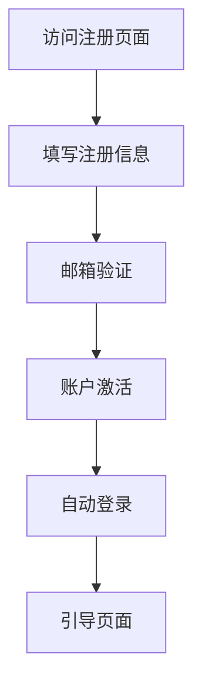
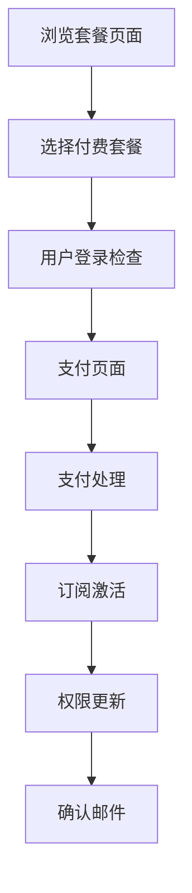
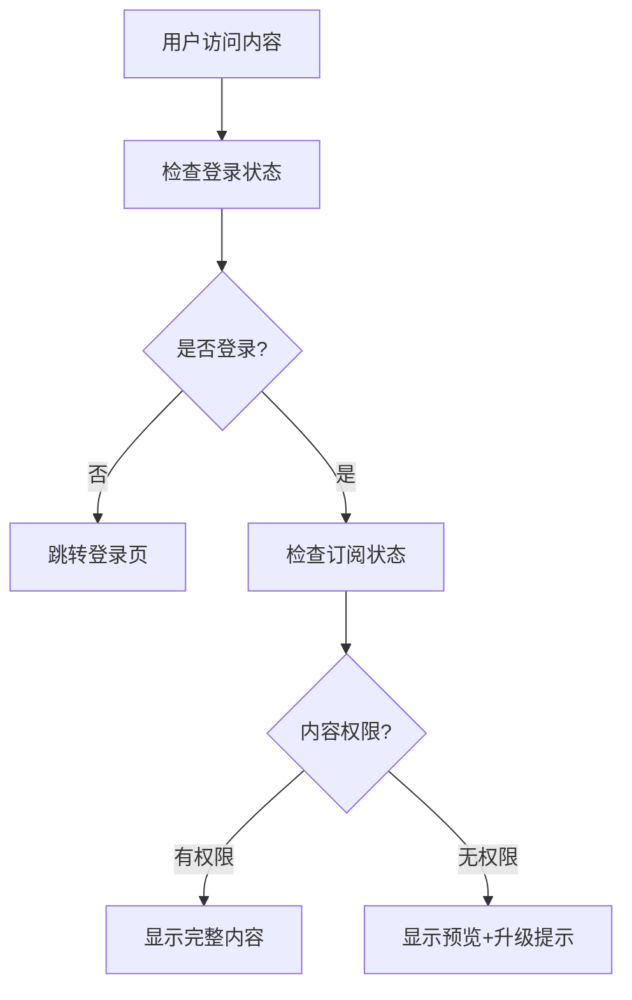
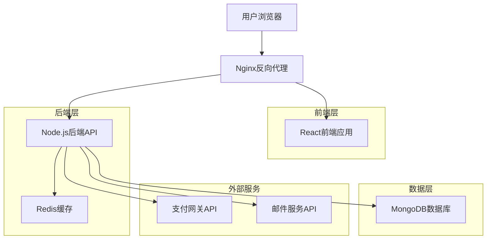
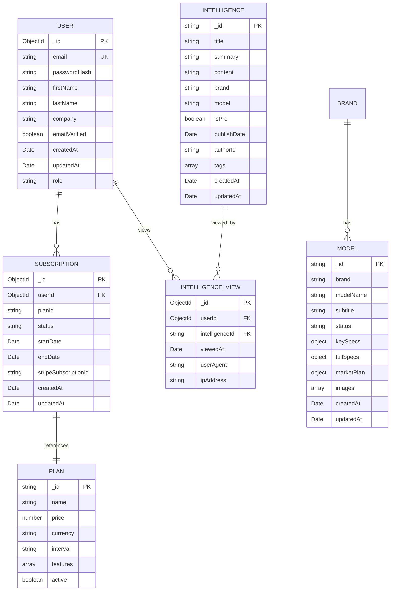

# China EV Intelligence Platform - 技术升级需求文档

## 1. 产品概述

本文档旨在为China EV Intelligence Platform制定技术升级方案，重点解决当前静态网站架构的局限性，实现动态数据管理、用户认证和商业化订阅功能。升级后的平台将从静态信息展示网站转型为功能完整的SaaS服务平台，支持用户注册、订阅管理和实时内容更新。

## 2. 核心功能

### 2.1 用户角色

| 角色 | 注册方式 | 核心权限 |
|------|----------|----------|
| 游客用户 | 无需注册 | 浏览基础信息、查看部分免费内容 |
| 免费用户 | 邮箱注册 | 访问基础车型数据、查看限量情报摘要 |
| 付费用户 | 邮箱注册+订阅 | 完整情报报告、高级筛选、数据导出、专家分析 |
| 管理员 | 内部分配 | 内容管理、用户管理、数据分析、系统配置 |

### 2.2 功能模块

升级后的平台包含以下核心页面和功能：

1. **用户认证页面**：注册、登录、密码重置、邮箱验证
2. **用户中心页面**：个人信息管理、订阅状态、使用统计、偏好设置
3. **订阅管理页面**：套餐选择、支付处理、订阅历史、发票管理
4. **内容管理后台**：情报发布、车型数据管理、用户权限控制
5. **数据分析仪表板**：用户行为分析、内容表现统计、收入报表

### 2.3 页面详情

| 页面名称 | 模块名称 | 功能描述 |
|----------|----------|----------|
| 用户注册页 | 注册表单 | 邮箱验证、密码强度检查、用户协议确认 |
| 用户登录页 | 登录表单 | 邮箱/用户名登录、记住登录状态、第三方登录集成 |
| 用户中心 | 个人信息 | 头像上传、基本信息编辑、密码修改、账户安全设置 |
| 用户中心 | 订阅管理 | 当前套餐显示、升级/降级操作、使用量统计、续费提醒 |
| 订阅页面 | 套餐选择 | 免费/付费套餐对比、功能差异展示、优惠活动显示 |
| 订阅页面 | 支付处理 | 多种支付方式、安全支付流程、订阅确认、发票生成 |
| 管理后台 | 内容管理 | 情报文章编辑、车型数据录入、图片上传、发布审核 |
| 管理后台 | 用户管理 | 用户列表、权限分配、订阅状态管理、行为分析 |
| API接口 | 数据服务 | RESTful API、认证中间件、数据验证、错误处理 |

## 3. 核心流程

### 用户注册流程


### 订阅购买流程


### 内容访问控制流程


## 4. 用户界面设计

### 4.1 设计风格

- **主色调**：深蓝色(#1a365d)、橙色(#ed8936)保持品牌一致性
- **辅助色**：灰色系(#718096, #e2e8f0)用于背景和边框
- **按钮样式**：圆角设计(border-radius: 8px)，悬停效果，渐变背景
- **字体**：Roboto字体系列，标题使用500-700字重，正文使用400字重
- **布局风格**：卡片式设计，响应式网格布局，顶部导航固定
- **图标风格**：线性图标风格，统一的视觉语言

### 4.2 页面设计概览

| 页面名称 | 模块名称 | UI元素 |
|----------|----------|--------|
| 用户注册页 | 注册表单 | 居中卡片布局，渐进式表单验证，实时密码强度指示器 |
| 用户登录页 | 登录表单 | 简洁表单设计，社交登录按钮，忘记密码链接 |
| 用户中心 | 导航菜单 | 左侧边栏导航，头像显示，快速操作按钮 |
| 订阅页面 | 套餐卡片 | 对比表格设计，推荐标签，价格突出显示，CTA按钮 |
| 支付页面 | 支付表单 | 安全标识，支付方式图标，进度指示器 |
| 管理后台 | 数据表格 | 分页表格，搜索筛选，批量操作，状态标签 |

### 4.3 响应式设计

采用移动优先的响应式设计策略，支持桌面端(1200px+)、平板端(768px-1199px)和移动端(<768px)。移动端优化触摸交互，增大点击区域，简化导航结构。

## 5. 技术架构设计

### 5.1 整体架构



### 5.2 技术栈选择

- **前端**: React 18 + TypeScript + Tailwind CSS + Vite
- **后端**: Node.js + Express.js + TypeScript
- **数据库**: MongoDB + Mongoose ODM
- **缓存**: Redis
- **认证**: JWT + bcrypt
- **支付**: Stripe API
- **邮件**: SendGrid API
- **部署**: Docker + PM2

### 5.3 路由定义

| 路由 | 用途 |
|------|------|
| /auth/register | 用户注册页面 |
| /auth/login | 用户登录页面 |
| /auth/forgot-password | 忘记密码页面 |
| /auth/reset-password | 密码重置页面 |
| /dashboard | 用户中心主页 |
| /dashboard/profile | 个人信息管理 |
| /dashboard/subscription | 订阅管理页面 |
| /pricing | 套餐选择页面 |
| /checkout | 支付结账页面 |
| /admin | 管理后台入口 |
| /admin/content | 内容管理页面 |
| /admin/users | 用户管理页面 |
| /admin/analytics | 数据分析页面 |

## 6. API接口设计

### 6.1 认证相关API

**用户注册**
```
POST /api/auth/register
```

请求参数:
| 参数名 | 类型 | 必填 | 描述 |
|--------|------|------|------|
| email | string | 是 | 用户邮箱 |
| password | string | 是 | 密码(最少8位) |
| firstName | string | 是 | 名字 |
| lastName | string | 是 | 姓氏 |
| company | string | 否 | 公司名称 |

响应示例:
```json
{
  "success": true,
  "message": "注册成功，请检查邮箱验证",
  "data": {
    "userId": "64f1a2b3c4d5e6f7g8h9i0j1",
    "email": "user@example.com"
  }
}
```

**用户登录**
```
POST /api/auth/login
```

请求参数:
| 参数名 | 类型 | 必填 | 描述 |
|--------|------|------|------|
| email | string | 是 | 用户邮箱 |
| password | string | 是 | 密码 |
| rememberMe | boolean | 否 | 记住登录状态 |

响应示例:
```json
{
  "success": true,
  "data": {
    "token": "eyJhbGciOiJIUzI1NiIsInR5cCI6IkpXVCJ9...",
    "user": {
      "id": "64f1a2b3c4d5e6f7g8h9i0j1",
      "email": "user@example.com",
      "firstName": "John",
      "lastName": "Doe",
      "subscription": {
        "plan": "free",
        "status": "active"
      }
    }
  }
}
```

### 6.2 订阅管理API

**获取订阅套餐**
```
GET /api/subscriptions/plans
```

响应示例:
```json
{
  "success": true,
  "data": [
    {
      "id": "free",
      "name": "免费套餐",
      "price": 0,
      "currency": "USD",
      "interval": "month",
      "features": [
        "基础车型数据",
        "限量情报摘要",
        "社区支持"
      ]
    },
    {
      "id": "pro",
      "name": "专业套餐",
      "price": 49,
      "currency": "USD",
      "interval": "month",
      "features": [
        "完整车型规格",
        "独家情报报告",
        "实时数据更新",
        "CEO洞察分析",
        "优先客服支持"
      ]
    }
  ]
}
```

**创建订阅**
```
POST /api/subscriptions/create
```

请求参数:
| 参数名 | 类型 | 必填 | 描述 |
|--------|------|------|------|
| planId | string | 是 | 套餐ID |
| paymentMethodId | string | 是 | Stripe支付方式ID |

### 6.3 内容管理API

**获取情报列表**
```
GET /api/intelligence?page=1&limit=10&brand=BYD
```

**创建情报文章**
```
POST /api/intelligence
```

**获取车型数据**
```
GET /api/models?brand=XPeng&status=launched
```

## 7. 数据库设计

### 7.1 数据模型定义



### 7.2 数据定义语言(DDL)

**用户表 (users)**
```javascript
// MongoDB Schema定义
const userSchema = new mongoose.Schema({
  email: {
    type: String,
    required: true,
    unique: true,
    lowercase: true,
    trim: true
  },
  passwordHash: {
    type: String,
    required: true
  },
  firstName: {
    type: String,
    required: true,
    trim: true
  },
  lastName: {
    type: String,
    required: true,
    trim: true
  },
  company: {
    type: String,
    trim: true
  },
  emailVerified: {
    type: Boolean,
    default: false
  },
  role: {
    type: String,
    enum: ['user', 'admin'],
    default: 'user'
  }
}, {
  timestamps: true
});

// 索引
userSchema.index({ email: 1 });
userSchema.index({ createdAt: -1 });
```

**订阅表 (subscriptions)**
```javascript
const subscriptionSchema = new mongoose.Schema({
  userId: {
    type: mongoose.Schema.Types.ObjectId,
    ref: 'User',
    required: true
  },
  planId: {
    type: String,
    required: true
  },
  status: {
    type: String,
    enum: ['active', 'canceled', 'past_due', 'unpaid'],
    default: 'active'
  },
  startDate: {
    type: Date,
    required: true
  },
  endDate: {
    type: Date,
    required: true
  },
  stripeSubscriptionId: {
    type: String,
    unique: true,
    sparse: true
  }
}, {
  timestamps: true
});

// 索引
subscriptionSchema.index({ userId: 1 });
subscriptionSchema.index({ status: 1 });
subscriptionSchema.index({ endDate: 1 });
```

**情报表 (intelligence)**
```javascript
const intelligenceSchema = new mongoose.Schema({
  _id: {
    type: String,
    required: true
  },
  title: {
    type: mongoose.Schema.Types.Mixed, // 支持多语言对象或字符串
    required: true
  },
  summary: {
    type: mongoose.Schema.Types.Mixed,
    required: true
  },
  content: {
    type: String,
    required: true
  },
  brand: {
    type: String,
    trim: true
  },
  model: {
    type: String,
    trim: true
  },
  isPro: {
    type: Boolean,
    default: false
  },
  publishDate: {
    type: Date,
    required: true
  },
  authorId: {
    type: mongoose.Schema.Types.ObjectId,
    ref: 'User',
    required: true
  },
  tags: [{
    type: String,
    trim: true
  }],
  viewCount: {
    type: Number,
    default: 0
  }
}, {
  timestamps: true
});

// 索引
intelligenceSchema.index({ publishDate: -1 });
intelligenceSchema.index({ brand: 1 });
intelligenceSchema.index({ isPro: 1 });
intelligenceSchema.index({ tags: 1 });
```

## 8. 安全考虑

### 8.1 认证安全
- **密码加密**: 使用bcrypt进行密码哈希，salt轮数设置为12
- **JWT安全**: 设置合理的过期时间(15分钟访问令牌，7天刷新令牌)
- **会话管理**: 实现令牌刷新机制，支持令牌撤销
- **邮箱验证**: 强制邮箱验证，防止虚假注册

### 8.2 API安全
- **请求限制**: 实现API速率限制，防止暴力攻击
- **输入验证**: 使用Joi进行严格的输入验证和清理
- **CORS配置**: 配置严格的跨域资源共享策略
- **HTTPS强制**: 生产环境强制使用HTTPS

### 8.3 数据安全
- **敏感数据加密**: 对PII数据进行加密存储
- **数据库安全**: MongoDB认证，网络访问限制
- **备份策略**: 定期自动备份，异地存储
- **审计日志**: 记录关键操作的审计日志

### 8.4 支付安全
- **PCI合规**: 使用Stripe处理支付，不存储信用卡信息
- **Webhook验证**: 验证Stripe webhook签名
- **金额验证**: 服务端验证支付金额
- **退款处理**: 实现安全的退款流程

## 9. 实施计划

### 第一阶段 (2-3周): 后端基础架构
- 搭建Node.js + Express后端框架
- 配置MongoDB数据库连接
- 实现基础的用户认证API
- 设置JWT认证中间件

### 第二阶段 (2-3周): 用户系统
- 完成用户注册、登录、密码重置功能
- 实现邮箱验证系统
- 开发用户中心前端页面
- 集成前后端认证流程

### 第三阶段 (3-4周): 订阅系统
- 集成Stripe支付网关
- 实现订阅计划管理
- 开发支付流程前端
- 实现内容访问权限控制

### 第四阶段 (1-2周): 测试与部署
- 全面功能测试
- 安全性测试
- 性能优化
- 生产环境部署

## 10. 成功指标

- **技术指标**: API响应时间<200ms，系统可用性>99.9%
- **用户指标**: 注册转化率>15%，付费转化率>5%
- **业务指标**: 月度经常性收入(MRR)增长，用户留存率>80%
- **安全指标**: 零安全事件，通过安全审计

通过实施这个技术升级方案，China EV Intelligence Platform将从静态展示网站转型为功能完整的SaaS平台，为用户提供更好的体验，为业务创造更大的价值。